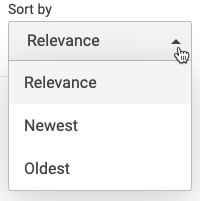

# CustomSortDropdown

Displays Sort components in a dropdown that can be styled as desired.

```
<div class="CoveoCustomSortDropdown" data-display-caption="true" data-caption="Sort by:">
    <span class="CoveoSort" data-sort-criteria="relevancy" data-caption="Relevance"></span>
    <span class="CoveoSort" data-sort-criteria="date descending" data-caption="Newest"></span>
    <span class="CoveoSort" data-sort-criteria="date ascending" data-caption="Oldest"></span>
</div>
```



Disclaimer: This component was built by the community at large and is not an official Coveo JSUI Component. Use this component at your own risk.

## Options

### caption (optional) : _string_

Specifies the title caption of the component

Example: `data-caption='Sort:'`

Default value is `Sort By:`.

### displayCaption (optional) : _boolean_

Whether to display caption

Default value is `false`.

Example: ` data-display-caption='true'`

### displayAsSelect (optional) : _boolean_

Whether to display component as a good old HTML Select element.

Default value is `false`.

Example: ` data-display-as-select='true'`

## Getting Started

1. Install the component into your project.

```
npm i @coveops/sort-dropdown
```

2. Use the Component or extend it

Typescript:

```javascript
import { SortDropdown, ISortDropdownOptions } from '@coveops/sort-dropdown';
```

Javascript

```javascript
const SortDropdown = require('@coveops/sort-dropdown').SortDropdown;
```

3. You can also expose the component alongside other components being built in your project.

```javascript
export * from '@coveops/sort-dropdown'
```

4. Include the component in your template as follows:

Place the component after the last tab in the `coveo-tab-section`

```html
<div class="CoveoSortDropdown"></div>
```

## Extending

Extending the component can be done as follows:

```javascript
import { SortDropdown, ISortDropdownOptions } from "@coveops/sort-dropdown";

export interface IExtendedSortDropdownOptions extends ISortDropdownOptions {}

export class ExtendedSortDropdown extends SortDropdown {}
```

## Contribute

1. Clone the project
2. Copy `.env.dist` to `.env` and update the COVEO_ORG_ID and COVEO_TOKEN fields in the `.env` file to use your Coveo credentials and SERVER_PORT to configure the port of the sandbox - it will use 8080 by default.
3. Build the code base: `npm run build`
4. Serve the sandbox for live development `npm run serve`